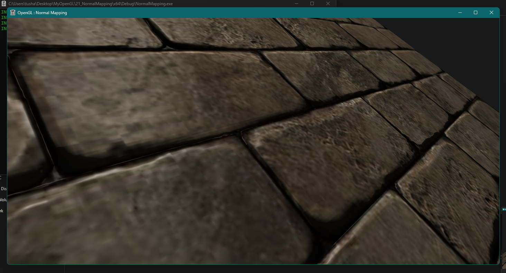
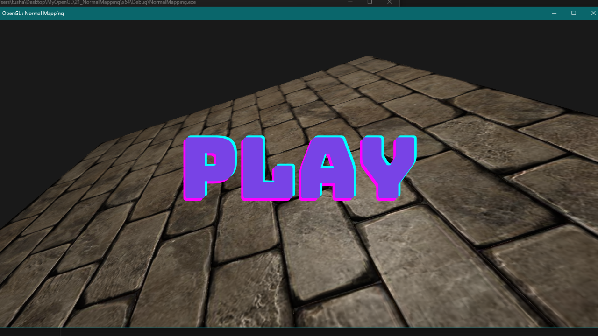
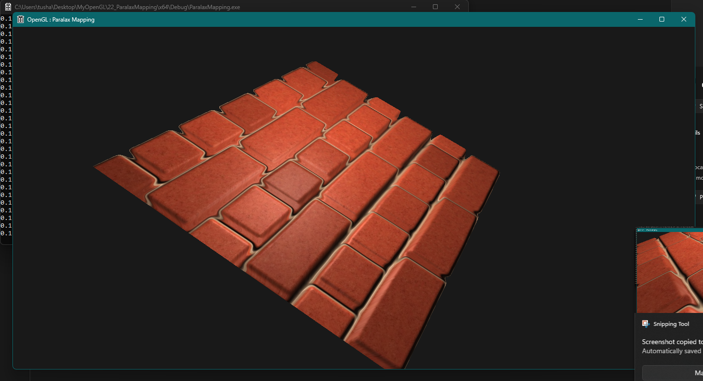
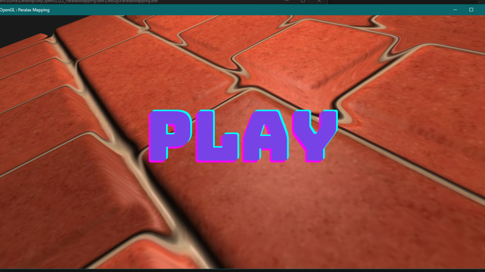
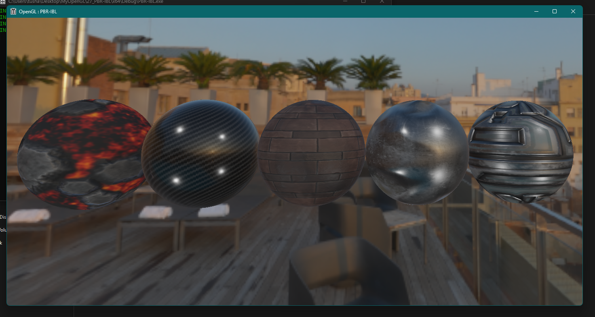
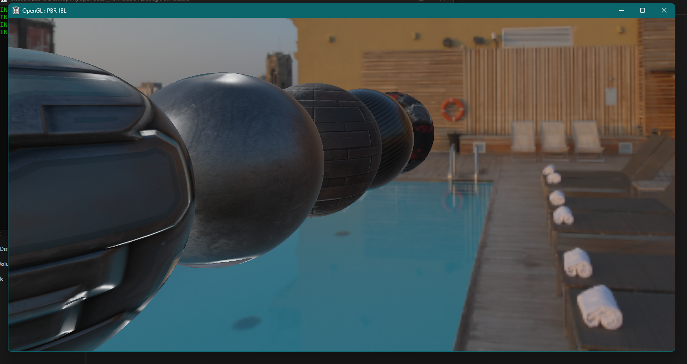

# OpenGL-PBR

## Description

This repository demonstrates Physically Based Rendering (PBR) techniques in OpenGL using C++ and GLSL. It explores a few PBR techniques: Normal Mapping, Parallax Mapping, and Image-Based Lighting (IBL), to create more realistic and visually appealing rendering.

## Screenshots

##### Normal Mapping

##### Parallax Mapping

##### Image Based Lighting

## Folder Structure

*   `01_NormalMapping`: Contains code for Normal Mapping implementation.
    *   `NormalMapping/x64/Debug`: Build files and executables.
    *   `resources`: Assets like textures for normal mapping.
    *   `shaders`: GLSL shader programs.
    *   `NormalMappingThumb.png`: Screenshot.

*   `02_ParallaxMapping`: Contains code for Parallax Mapping implementation.
    *   `ParallaxMapping/x64/Debug`: Build files and executables.
    *   `resources`: Texture assets for parallax mapping.
    *   `shaders`: GLSL shader programs.
    *   `ParallaxMappingThumb.png`: Screenshot.

*   `03_PBR-IBL`: Contains code for Image-Based Lighting (IBL) PBR.
    *   Code not provided, but would contain similar file structure

*   `.gitignore`: Files to ignore in Git.

## Dependencies

*   **GLEW (OpenGL Extension Wrangler Library):** Download GLEW and add the `include` directory and library files (e.g., `glew32.lib`) to system environment variables.
*   **GLM (OpenGL Mathematics):** Download GLM. Simply copy the `glm` directory into the project's include path.

**Note:** Add GLEW, Assimp, and GLM to system environment variables (INCLUDE and LIB) so Visual Studio can find them.

## Build Instructions (Visual Studio 2022)

1.  **Clone Repository:** `git clone https://github.com/Tushar-Wagdare/OpenGL-PBR.git`
2.  **Open Solution:** Open `OGL.sln` in either the `01_NormalMapping` or `02_ParallaxMapping` directory.
3.  **Build:** Go to `Build` -> `Build Solution` (Ctrl+Shift+B).
4.  **Ensure Dependencies:** Dependencies must be installed and in system environment variables.
5.  **Run:** Run executable in `x64/Debug`.

## Usage

After building:

*   **`01_NormalMapping`:** Observe enhanced details using normal mapping.
*   **`02_ParallaxMapping`:** Experiment with parallax mapping for depth illusion.
*   Remember to replace link to your appropriate links to the video
